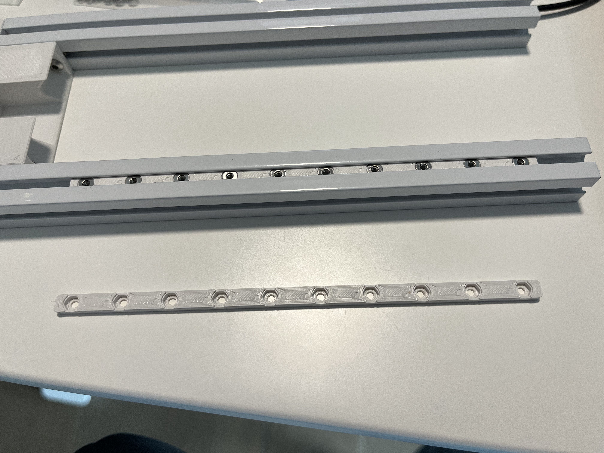

This is an improved nutbar for mounting MGN7/5 rail on a Misumi 1515 extrusion.

In comparison to official Voron 0.1 nutbars:

* Added cutout for DIN 125A M2 washer.
* Added thickness to sliding fit Misumi 1515 profile, so the washer and nut are less likely to escape.

Why?

DIN 934 nuts are simply inappropriate to use on a Misumi 1515 extrusion without a washer.
The channel opening is 3.4mm wide. Although the width across the flats of a DIN 934 M2 nut is 3.82~4.00mm
wide so it won't simply slide out, there can be a chamfer on the edge,
and the diameter of the flat surface is only guaranteed to be at least 3.2mm.

This implies that in the worse case there is only a 0.21mm 45deg chamfer engaged on each side.
It would damage the extrusion if proper fastening torque of 0.3Nm as recommended by Hiwin is used.

While many V0.1 owners purchased the steel nutbar, which is definitely superior than mine,
it is a speciality product that is kind of against the Voron spirit.
With my nutbar you can simply use standard DIN washer and nuts.
